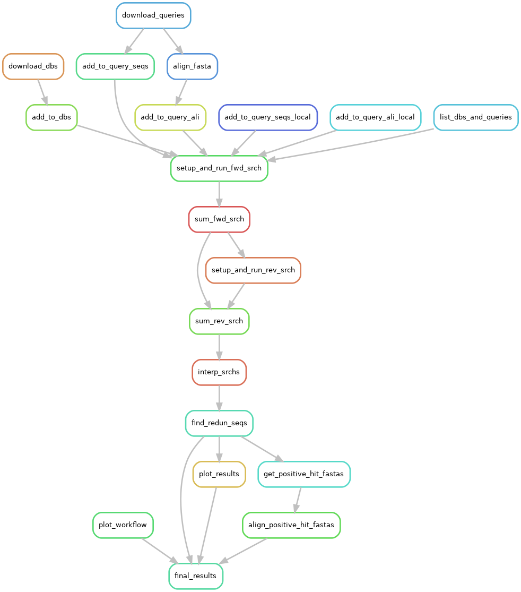
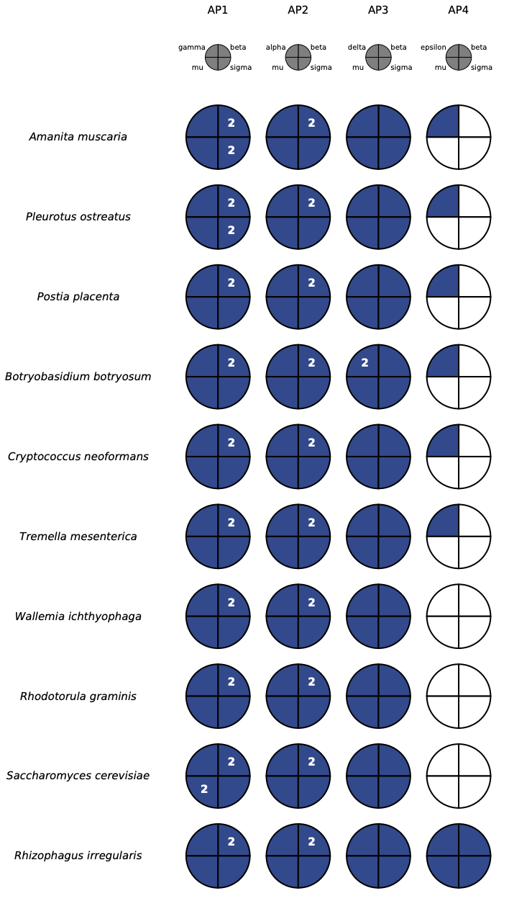

<p align="center">

</p>


## Introduction

**A**nalysis of **MO**lecular **E**volution with **BA**tch **E**ntry (AMOEBAE)
is a customizable bioinformatics workflow for identifying homologues (and
potential orthologues) of genes of interest among a mid-size sampling of
genomes. This workflow is designed to be run on high-performance computing
(HPC) clusters and is executed via the
[SnakeMake](https://snakemake.readthedocs.io/en/stable/) workflow management
system. Code for steps in this workflow is written primarily in
[Python3](https://www.python.org/),
relying heavily on the [Biopython](https://biopython.org/) library, and apply
bioinformatics packages including
[BLAST+](https://www.ncbi.nlm.nih.gov/books/NBK279690/) and
[HMMER3](http://hmmer.org/) to input data files. AMOEBAE is open-source, and
all dependencies are freely available. [Lael D.
Barlow](https://scholar.google.com/citations?user=wohF-LAAAAAJ&hl=en&oi=ao) is
the author.

AMOEBAE is useful for certain mid-scale comparative genomics studies that
might otherwise require time-intensive and repetitive
manual/visual manipulation of data. Webservices such as those provided by
[NCBI](https://blast.ncbi.nlm.nih.gov/Blast.cgi)
and [EMBL-EBI](https://www.ebi.ac.uk/Tools/hmmer/) provide a means to
readily investigate the evolution of one or a few genes via similarity searching,
and large-scale analysis workflows such as
[OrthoMCL](https://orthomcl.org/orthomcl/) and
[OrthoFinder](https://github.com/davidemms/OrthoFinder) attempt to rapidly perform orthology
prediction for all genes among several genomes. AMOEBAE addresses 
analyses which are too cumbersome to be performed via webservices or simple
scripts and yet require a level of detail and flexibility not offered by
large-scale analysis workflows. AMOEBAE is useful for analyzing the
distribution of homologues of up to approximately 30 genes/proteins among a
sampling of no more than approximately 100 eukaryotic genomes, especially when
follow-up with custom phylogenetic analysis is planned.

AMOEBAE serves this purpose by providing several unique features. The core
functionality of AMOEBAE is to run sequence similarity searches with multiple
algorithms, multiple queries, and multiple databases simultaneously and to
allow highly customizable implementation of reciprocal-best-hit search
strategies. The output includes detailed summaries of results in the form of a
spreadsheet and presence/absence plots. A particular advantage of AMOEBAE
compared to other workflows is its functionality for parsing results of TBLASTN
(which searches nucleotide sequences with peptide sequence queries) search
results. This allows rapid identification of High-scoring Segment Pair (HSP)
clusters at separate gene loci, automatic checking of those loci against
information in genome annotation files, and systematic use of the
[Exonerate](http://europepmc.org/article/MED/15713233) package where possible
for obtaining better exon predictions. In addition, AMOEBAE provides many
    options which can be tailored to the specific genes/proteins being
    analyzed. Despite the complexity of this workflow, analyses performed using
    AMOEBAE can be reproduced via
    [SnakeMake](https://snakemake.readthedocs.io/en/stable/).

Here's a diagram of the steps in the overall workflow:

<p align="center">

</p>


## Requirements 

The following setup procedure should work on most Linux HPC clusters. This can
also be run on Linux or MacOS personal computers, but this is generally not
recommended due to requirements of storage (~30GB+) and computation time. 

This workflow has minimal essential dependencies (see below for installation
instructions):
- Python version 3.
- [Conda](https://docs.conda.io/en/latest/miniconda.html) **or**
  [Singularity](https://sylabs.io/docs/)
  version 3.6+.

## Installation

These instructions are for setting up and running AMOEBAE via the
[SnakeMake](https://snakemake.readthedocs.io/en/stable/) command-line
interface, which provides the flexibility to run AMOEBAE in a wide variety of
systems (further automation via custom scripts is possible, but will likely be
very user-specific in design). 

1. If you do not already have the conda package and environment manager
   installed, this may be easily installed using the latest version of
   Miniconda3 from the [conda
   website](https://docs.conda.io/en/latest/miniconda.html). Some HPC clusters
   do not allow use of conda, but in such cases conda can still be used to
       install software in [Singularity](https://sylabs.io/docs/) containers
       (this process is automated by snakemake). If singularity is not already
       installed on your system, you will need to request that you system
       administrator install it for you. 

2. If you do not already have the snakemake workflow manager installed then you
   will need to install it. If you have conda installed, then you can follow
   the [snakemake installation
   instructions](https://snakemake.readthedocs.io/en/stable/getting_started/installation.html)
   on the snakemake website. If conda cannot be installed, then snakemake can
   be installed in a Python virtual environment as follows: ...

   In addition,
   cookiecutter

4. If running on an HPC cluster (recommended) then you will need to generate
   cluster configuration files so that snakemake knows how to submit jobs
   appropriately on your system. This is described in the [snakemake
   documentation on
   profiles](https://snakemake.readthedocs.io/en/stable/executing/cli.html#profiles).
   To set up a profile, select the appropriate template profile for your system
   from the [snakemake profiles](https://github.com/snakemake-profiles/doc),
   and follow the relevant setup instructions provided. This will write new
   files to a new hidden directory in your filesystem. For example, if your HPC
   cluster uses PBS-TORQUE, and you choose to name the new snakemake
   profile "pbs-torque", then cluster configuration files will be written to a
   directory with the path `~/.config/snakemake/pbs-torque`. For example:
```
mkdir -p ~/.config/snakemake
cd ~/.config/snakemake
cookiecutter https://github.com/Snakemake-Profiles/pbs-torque.git
chmod a+x ~/.config/snakemake/pbs-torque/*.py
```

5. To edit the cluster configuration in the snakemake profile (if necessary),
   edit the `cluster_config.yaml` or `cluster.yaml` file (depends on what type
   of profile) using your favourite text editor. Details of the configuration
   will depend on the job scheduler and resources available on your system, and
   can be modified at any time.

6. Clone the AMOEBAE repository into an appropriate directory.
```
    git clone https://github.com/laelbarlow/amoebae.git 
    cd amoebae
```

7. Collect input FASTA files. 


8. Do a dry-run to verify that all the necessary files are in place.
```
snakemake -n
```

9. Set up data.
```
snakemake get_ref_seqs -j 100 --use-conda --profile sge
```


7. Execute one workflow step to verify the workflow definition and cluster
   profile setup, and generate a diagram of steps in the workflow. This should
   write a PDF file to the results subdirectory.

```
    make dry_run
```

## Running the workflow

Several features make this workflow easy to run as a proof of principle while
still allowing unlimited customization. Initial steps in the workflow involve
accessing sequence data from [National Center for Biotechnology Information
(NCBI) databases](https://www.ncbi.nlm.nih.gov/). However, this is simply for
convenience, and this workflow could be customized to take use any FASTA files
as input. The output files include a plot of the number of identified
homologues (potential orthologues) of several genes across several genomes, as
well as a spreadsheet in CSV format providing a detailed summary of search
results. Snakemake is used to manage the workflow, but for ease of use [GNU
Make](https://www.gnu.org/software/make/) is used to run Snakemake commands in
Python virtual environments (see the Makefile file). Without customization,
this workflow should take between 30 and 60 minutes to run, depending on
resource availability on your system.  

To run the workflow without customization (using example data), follow these
steps:

1. Execute initial workflow steps to download and format sequence data and
   generate lists of potential reference orthologues. Here, and in subsequent
   steps,
   [nohup](https://www.gnu.org/software/coreutils/manual/html_node/nohup-invocation.html)
   is used in the Makefile to prevent the process from being interrupted if you
   log out or are disconnected. So, the standard output will be appended to the
   nohup.out file, which can be viewed with cat (`cat nohup.out`) or tail
   (`tail -f nohup.out`).

```
    make run_data_setup
```

2. Open the reference sequence prediction file
   (results/Ref\_seqs\_1\_manual\_selections.csv), and manually edit in a
   spreadsheet editor (e.g., Microsoft Excel) to select relevant reference
   orthologues for downstream analysis (see AMOEBAE documentation
   [here](https://github.com/laelbarlow/amoebae/blob/master/documentation/AMOEBAE_documentation.pdf)
   for further information). Or, if you have not customized this workflow (are
       using the example data), you
       can simply copy the example file from the resources directory:
```
    cp resources/example_Ref_seqs_1_manual_selections.csv \
       results/Ref_seqs_1_manual_selections.csv
```

3. Execute remainder of the workflow.

```
    make run
```

4. View results summary files and positive hit sequence alignments at these
   paths (one way is to download with an SFTP client such as
   [Cyberduck](https://cyberduck.io/download/)):
```
    results/plot_coulson_both.pdf
    results/fwd_srchs_1_rev_srch_1_interp_with_ali_col_nonredun.csv
    results/fwd_srchs_1_rev_srch_1_interp_with_ali_col_nonredun_fasta_ali_files
```

Here's an example coulson plot output by the workflow. Note that these results
require careful interpretation, and in most cases re-analysis with modified
parameters will be necessary as well as follow up with additional methods such
as phylogenetic analysis.

<p align="center">

</p>


## Archiving a completed workflow

To archive a completed workflow, including input files, output files, code, and
installed dependencies, simply run this command:
```
    make archive
```

## Additional features

- To enter custom snakemake commmands, activate the Python virtual
  environment (in which snakemake is installed) using this command:
```
    source scripts/activate_python_env.sh
```
- To stop a workflow that is running, use this command. It will kill the
  background process that Snakemake is running in. However, jobs already
  submitted to the cluster (by Snakemake) will need to be cancelled manually.
```
    make killall
```


## Un-installation

To remove all files and folders associated with this workflow, including
analysis results and virtual environments, simply run this command.

```
    make uninstall
```

## Customization

- To search in a different set of genomes/proteomes/transcriptomes, modify the
  `resources/genomes.csv` file by adding information about predicted peptide
  FASTA files (.faa), nucleotide FASTA files (.fna), or GFF3 annotation files
  (.gff3) of interest.
    - In the "FASTA header delimiter" column, enter the text character that
      separates sequence IDs from other elements of the FASTA header. In the
      case of FASTA files from NCBI for example, this is usually a space
      character.
    - In the "Sequence ID position" column, enter the position of the sequence
      ID in a list resulting from splitting the whole FASTA header on the
      character defined in the "FASTA header delimiter" column. Importantly,
      counting starts from zero, so if the sequence header starts with the
      sequence ID (as in the case of most NCBI FASTA files), then the value in
      this column should be "0".
    - If the FASTA files are to be downloaded from a website, enter the URL in
      the "Location" column. Otherwise, it will be assumed that the files have
      been copied to the `resources/local_db_files` directory.
- If you wish to search in any local FASTA files (instead of downloading
  directly from NCBI), copy those to the resources/local\_db\_files directory
  (in addition to listing them in the genomes.csv file).
- To search with different query sequences, modify the `resources/queries.csv`
  file.
    - There are only two columns: "Filename" and "Sequence ID". There may be
      multiple rows with the same filename, but different sequence IDs. In such
      cases, the indicated sequences will be downloaded from NCBI and aligned
      to make a sequence profile query for similarity searching.
    - If the Sequence ID field is left blank in a row, then the filename will
      be assumed to correspond to a file in the `resources/local_query_files`
      directory.
- If you wish to search using local query (FASTA) files, copy them to the
  `resources/local_query_files` directory (in addition to listing their
  filenames in the queries.csv file). 
- If necessary, list a different database file to use for identifying reference
  sequences and running reverse searches against, by modifying the
  `resources/reference_db_list.txt` file. Well-annotated reference genomes,
  such as those of *Arabidopsis thaliana*, *Saccharomyces cerevisiae*, or *Homo
  sapiens* are most useful for this purpose.
- If you have previous results yielded prior to customizing the workflow, clear
  the results directory before proceeding:
```
    make clean_results
```
- Run the customized workflow as described above, ensuring you
  manually/visually define the sets of reference homologues/orthologues to use
  for interpreting reciprocal search results for searches with each query.
- For more advanced customization, refer to the Snakemake documentation and
  modify the Snakefile (snakemake workflow definition file): 
```
    vim workflow/Snakefile    
```


## Additional documentation

Documentation for the AMOEBAE command line interface is provided here:
[AMOEBAE_documentation.pdf](
https://github.com/laelbarlow/amoebae/blob/master/documentation/AMOEBAE_documentation.pdf).
This information is important for customizing rules in the
[Snakefile](https://github.com/laelbarlow/amoebae/blob/master/workflow/Snakefile)
(workflow definition file) for your projects.


## Recent changes

#### 2020 November 15

The main amoebae repository (this repository) was updated for workflow
management via [Snakemake](https://snakemake.readthedocs.io/en/stable/) and
package management via [Conda](https://docs.conda.io/en/latest/). This has many
advantages including simplifying the installation process considerably (see
instructions above). Also, AMOEBAE now runs on Compute Canada clusters (via the
SLURM job scheduler) using environment modules and a Python venv virtual
environment.


## Contact info

For general inquiries, please contact the author at amoebae.software@gmail.com.

Also, please use the [issue tracker](https://github.com/laelbarlow/amoebae/issues) on
the GitHub webpage to report any problems you encounter while using AMOEBAE.


## How to cite AMOEBAE

Please cite the [AMOEBAE GitHub
repository](https://github.com/laelbarlow/amoebae) (or alternative permanent
repositories if relevant). Also, please remember to cite the software packages which
are dependencies of AMOEBAE.


## Acknowledgments

AMOEBAE was initially developed at the Dacks Laboratory at the University of
Alberta, and was supported by National Sciences and Engineering Council of
Canada (NSERC) Discovery grants RES0021028, RES0043758, and RES0046091 awarded
to Joel B. Dacks, as well as an NSERC Postgraduate Scholarship-Doctoral awarded
to Lael D. Barlow.

We acknowledge the support of the Natural Sciences and Engineering Research Council of Canada (NSERC).

Cette recherche a été financée par le Conseil de recherches en sciences naturelles et en génie du Canada (CRSNG).


Also, help with testing AMOEBAE has been kindly provided by Raegan T. Larson,
Shweta V. Pipalya, Kira More, Kristína Záhonová, and Emily K. Herman.


## License

Copyright 2018 Lael D. Barlow

Licensed under the Apache License, Version 2.0 (the "License");
you may not use this file except in compliance with the License.
You may obtain a copy of the License at

http://www.apache.org/licenses/LICENSE-2.0

Unless required by applicable law or agreed to in writing, software
distributed under the License is distributed on an "AS IS" BASIS,
WITHOUT WARRANTIES OR CONDITIONS OF ANY KIND, either express or implied.
See the License for the specific language governing permissions and
limitations under the License.


